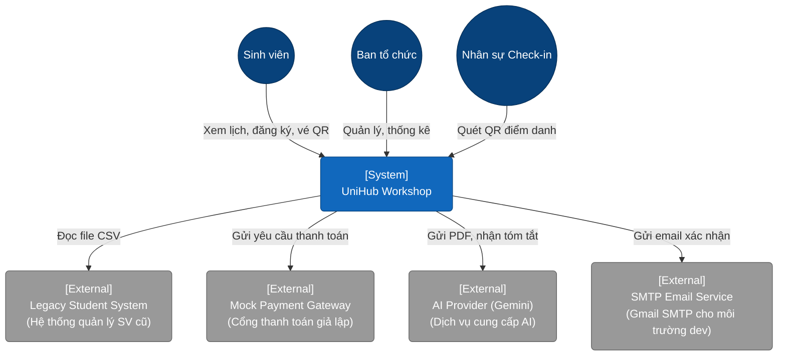
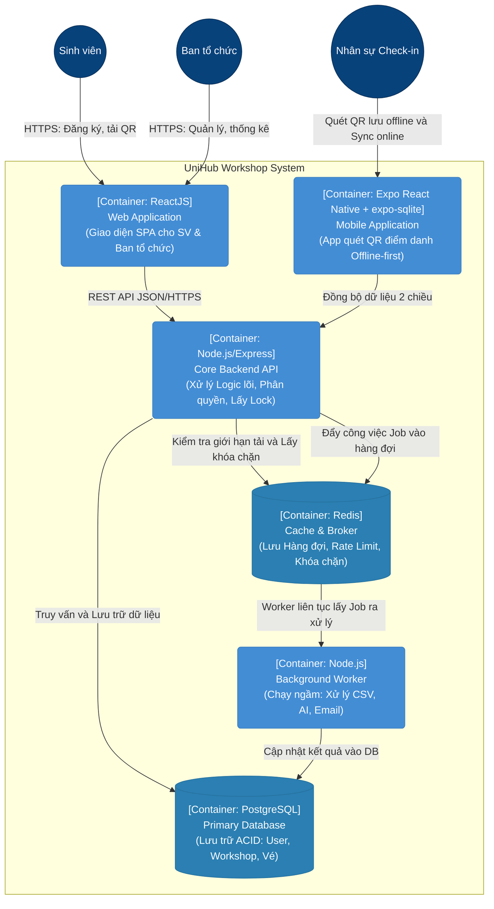
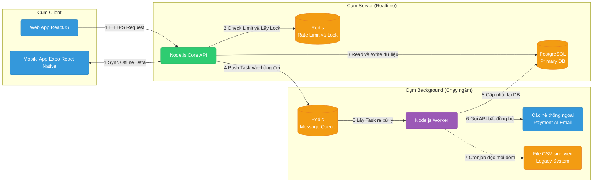

# UniHub Workshop — Technical Design

## Kiến trúc tổng thể

Hệ thống UniHub được thiết kế theo kiến trúc Client-Server kết hợp Background Processing.

- Lý do lựa chọn: Do giới hạn thời gian (2 tuần), kiến trúc Microservices là quá phức tạp và tốn thời gian thiết lập hạ tầng. Thay vào đó, một Backend API tập trung (Node.js) xử lý toàn bộ request realtime kết hợp với một Worker chạy ngầm sẽ đảm bảo API không bị nghẽn khi phải xử lý các tác vụ nặng (đọc CSV, gọi AI, gửi email).
- Xử lý sự cố: Nếu Worker (xử lý nền) gặp sự cố (ví dụ crash khi đọc file CSV lỗi), hệ thống API chính vẫn sống và sinh viên vẫn đăng ký workshop bình thường. Nếu Cổng thanh toán (hệ thống ngoài) chết, hệ thống áp dụng Graceful Degradation (Circuit Breaker) để không làm treo giao diện.

## C4 Diagram

### Level 1 — System Context

### Level 2 — Container

## High-Level Architecture Diagram

Sơ đồ tập trung vào luồng dữ liệu - Data Flow

## Thiết kế cơ sở dữ liệu

### Hệ thống sử dụng mô hình đa cơ sở dữ liệu (Polyglot Persistence) để tối ưu cho từng bài toán cụ thể:

- PostgreSQL (Database chính): Chọn cơ sở dữ liệu quan hệ (RDBMS) vì nghiệp vụ đăng ký workshop đòi hỏi tính toàn vẹn dữ liệu (ACID) cực kỳ cao. Khi xử lý trừ số lượng available_slots, các transaction của SQL kết hợp với cơ chế khóa (Lock) sẽ ngăn chặn tuyệt đối tình trạng overbooking.
- Redis (In-memory Database): Sử dụng làm bộ nhớ đệm (Cache) để giảm tải cho DB chính khi hàng ngàn sinh viên cùng load danh sách workshop. Đồng thời dùng để lưu trữ trạng thái Rate Limiting, Idempotency Key và làm Message Broker (hàng đợi xử lý bất đồng bộ).
- Expo SQLite (expo-sqlite, Local DB): Lưu trữ dữ liệu danh sách mã QR trên thiết bị check-in để phục vụ luồng check-in offline.

### Thiết kế Schema cho các Entity quan trọng nhất (PostgreSQL):

- Users: id (PK), email, full_name, role (STUDENT, ORGANIZER, CHECKIN_STAFF), created_at.
- Workshops: id (PK), title, description, room_name, total_slots, available_slots, is_paid, price, start_time, end_time. (Cột available_slots sẽ được đánh Index để truy vấn nhanh).
- Registrations: id (PK), user_id (FK), workshop_id (FK), qr_code_hash, payment_status (PENDING, PAID, FAILED), checkin_status (BOOLEAN), checkin_time.
- Payments: id (PK), registration_id (FK), idempotency_key (UNIQUE), amount, status, created_at.

## Thiết kế kiểm soát truy cập

Hệ thống sử dụng mô hình RBAC (Role-Based Access Control) kết hợp với JWT (JSON Web Token) để phân quyền và xác thực người dùng.

- Xác thực (Authentication): Sau khi đăng nhập, hệ thống cấp 1 Access Token (thời hạn ngắn, 15 phút) lưu ở bộ nhớ tạm của Frontend và 1 Refresh Token (thời hạn dài, 7 ngày) lưu trong HttpOnly Cookie để chống tấn công XSS.
- Chính sách allow email: Ngoài lọc theo domain (`ALLOWED_EMAIL_DOMAINS`), hệ thống hỗ trợ danh sách email cho phép trực tiếp qua `ALLOWED_ADMIN_EMAILS`, `ALLOWED_STAFF_EMAILS` và `ALLOWED_USER_EMAILS` để whitelist các tài khoản đặc biệt.
- Phân quyền (Authorization): Định nghĩa 3 Role với quyền hạn thiết lập chặt chẽ tại Middleware của Backend API:
  - STUDENT: Chỉ có quyền GET /api/workshops, POST /api/registrations, GET /api/registrations và các endpoint chi tiết registration của chính mình.
  - ORGANIZER: Có quyền truy cập các endpoint nội bộ POST/PUT/DELETE /workshops, xem thống kê GET /stats, và trigger API AI Summary.
  - CHECKIN_STAFF: Chỉ có quyền gọi API đồng bộ danh sách QR GET /api/sync-data và cập nhật trạng thái điểm danh PUT /api/registrations/sync.

## Thiết kế các cơ chế bảo vệ hệ thống

### Kiểm soát tải đột biến

- Giải pháp: Sử dụng thuật toán Token Bucket thực thi trên Redis.
- Cách hoạt động: Giới hạn mỗi User/IP chỉ được phép gửi tối đa 30 requests / phút. Nếu vượt quá (ví dụ bot spam hoặc user bấm F5 liên tục), API Gateway chặn ngay lập tức và trả về HTTP Status 429 Too Many Requests.
- Bổ trợ: Với 12.000 sinh viên truy cập đồng thời, giao diện “Xem lịch workshop” sẽ được Cache thẳng trên Redis. API sẽ trả về dữ liệu từ RAM thay vì xuống PostgreSQL, giúp hệ thống không bị crash ở những phút đầu tiên.

### Xử lý cổng thanh toán không ổn định

- Giải pháp: Triển khai Design Pattern Circuit Breaker (Cầu dao tự động) kết hợp Graceful Degradation (Suy giảm duyên dáng).
- Cách hoạt động: Khi API gọi sang Cổng thanh toán (Mock), hệ thống đếm số lỗi trong cửa sổ thời gian. Mặc định nếu có 5 lỗi trong 60 giây (`PAYMENT_CB_THRESHOLD=5`, `PAYMENT_CB_WINDOW_MS=60000`), Circuit Breaker sẽ chuyển sang trạng thái OPEN; sau 30 giây (`PAYMENT_CB_OPEN_MS=30000`) sẽ thử HALF_OPEN.
- Hành vi khi lỗi: Lúc này, mọi request thanh toán mới sẽ bị chặn ngay ở backend (Fail-fast) trả về lỗi mượt mà cho client (“Cổng thanh toán đang bảo trì, vui lòng thử lại sau 5 phút”) thay vì treo hệ thống. Đặc biệt (Graceful Degradation), database và các API khác vẫn hoạt động bình thường, sinh viên vẫn có thể lướt xem workshop hoặc đăng ký các workshop Miễn phí.

### Chống trừ tiền hai lần

- Giải pháp: Sử dụng cơ chế Idempotency Key.
- Cách hoạt động:
  - Khi sinh viên bấm “Thanh toán”, Frontend sinh ra một UUID ngẫu nhiên (Vd: key_123) và gắn vào Header X-Idempotency-Key của request.
  - Backend nhận được request, sẽ kiểm tra key này trong Redis.
  - Nếu key CHƯA tồn tại: Thực hiện trừ tiền, lưu trạng thái thành công và gán key_123 vào Redis (với TTL hết hạn sau 24h).
  - Nếu cổng thanh toán chập chờn, mạng lag, sinh viên bấm nút thanh toán thêm 3 lần nữa (cùng gửi lên key_123). Backend thấy key này ĐÃ có trong Redis, sẽ lập tức trả về kết quả của lần xử lý trước đó mà không thực hiện gọi cổng thanh toán lần 2. Khi gateway lỗi kéo dài, request có thể được đưa vào hàng đợi retry và trả trạng thái queued/pending để client polling.

## Các quyết định kỹ thuật quan trọng (ADR)

- ADR 1: Chọn PostgreSQL thay vì MongoDB làm Database chính
  - Đánh đổi: MongoDB linh hoạt hơn về cấu trúc, nhưng hệ thống UniHub có yêu cầu rất khắt khe về việc trừ số lượng chỗ trống (available_slots). PostgreSQL hỗ trợ cơ chế Locking mạnh mẽ (Pessimistic/Optimistic Lock) và Transaction ACID, giúp giải quyết triệt để bài toán tranh chấp chỗ ngồi, điều mà NoSQL xử lý khó khăn hơn.
- ADR 2: Sử dụng Redis làm Message Broker (với BullMQ) thay vì Kafka/RabbitMQ
  - Đánh đổi: Kafka/RabbitMQ là những hệ thống Message Queue chuyên dụng và mạnh mẽ cho production. Tuy nhiên, với nhân lực 2 người và thời gian 2 tuần, việc setup hạ tầng Kafka là lãng phí. Redis có sẵn tốc độ cực cao, lại đang được dùng cho Cache/Rate Limit, nên tích hợp thêm thư viện BullMQ trên Node.js để chạy Background Worker (gửi email, gọi AI, đọc CSV) là quyết định tối ưu nguồn lực nhất.
- ADR 3: Thiết kế App Expo React Native cho luồng Check-in thay vì Web App
  - Đánh đổi: Cần code thêm một ứng dụng di động (Expo React Native) thay vì dùng chung hoàn toàn React Web. Tuy nhiên, trình duyệt Web (kể cả PWA) đôi khi không ổn định trong việc lưu trữ offline khi bộ nhớ điện thoại đầy (bị hệ điều hành tự động dọn cache). Ứng dụng Expo React Native kết hợp cơ sở dữ liệu cục bộ (expo-sqlite) giúp dữ liệu điểm danh offline được lưu trữ bền vững và đồng bộ hóa an toàn khi có mạng trở lại.
