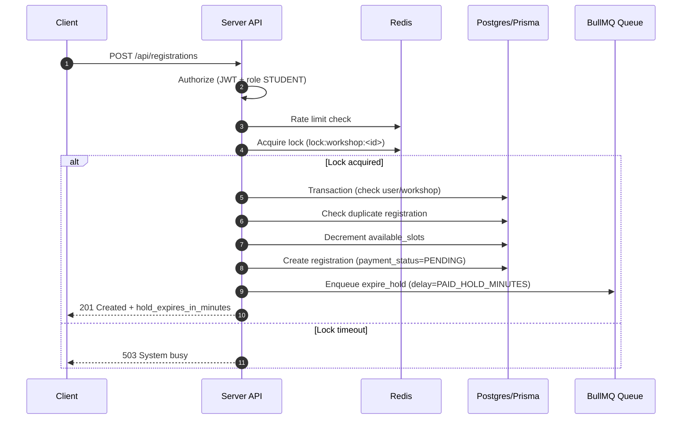
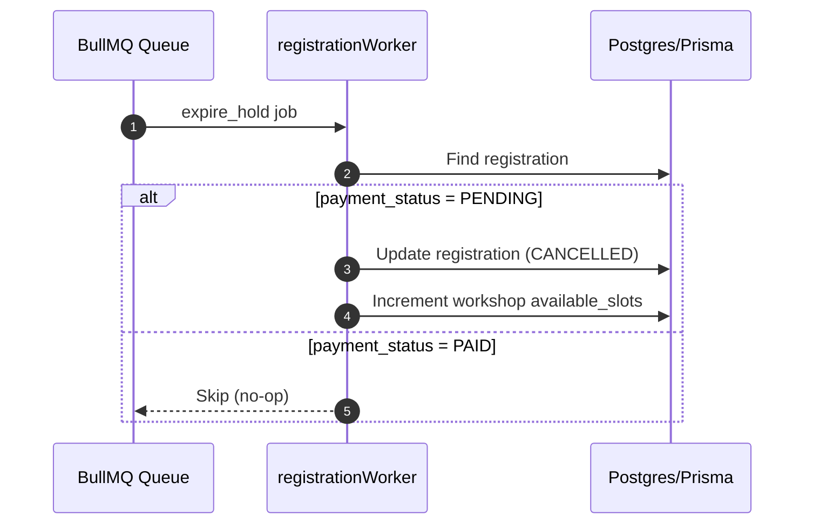

# Workshop Registration - Hướng dẫn sử dụng chi tiết

## Tổng quan

Workshop Registration là luồng đăng ký tham gia workshop dành cho sinh viên. Đây là phần quan trọng vì liên quan trực tiếp tới **giữ chỗ**, **thanh toán**, **phát hành QR**, và **giới hạn số lượng slot**. Hệ thống xử lý:

- Đồng bộ số lượng chỗ còn lại bằng transaction.
- Khóa phân tán (Redis) để tránh race condition khi nhiều người đăng ký cùng lúc.
- Tự động **giữ chỗ** với workshop có phí và hủy giữ chỗ nếu quá hạn.
- Gửi thông báo cho workshop miễn phí sau khi đăng ký thành công.

### Kiến trúc

```
Client
  │
  ▼
POST /api/registrations
  │ authorize (JWT + role STUDENT)
  │ rate limit (Redis token bucket)
  │ acquire lock (Redis)
  ▼
Prisma Transaction
  ├─ check user + workshop
  ├─ check duplicate registration
  ├─ decrement available_slots
  └─ create registration + qr_code_hash
  │
  ├─ Free workshop  -> enqueue notification (Email)
  └─ Paid workshop  -> enqueue hold-expiry job (BullMQ)
```

## Luồng hoạt động chi tiết

### 1. Đăng ký workshop miễn phí

1. Client gọi `POST /api/registrations` với `workshop_id`.
2. Server xác thực JWT và role `STUDENT`.
3. Server rate-limit theo user id (Redis).
4. Server lấy lock theo `workshop_id` để tránh trùng slot.
5. Trong transaction:
   - Kiểm tra user và workshop tồn tại.
   - Kiểm tra đã đăng ký chưa.
   - Giảm `available_slots` (chỉ khi còn chỗ).
   - Tạo registration và sinh `qr_code_hash`.
   - Set `payment_status = PAID` (vì workshop miễn phí).
6. Server enqueue email notification (QR ticket).
7. Response trả về `registration_id`, `qr_code_hash`, `payment_status`.

### 2. Đăng ký workshop có phí

1. Các bước giống workshop miễn phí (lock + transaction).
2. Khi tạo registration:
   - Set `payment_status = PENDING`.
   - Trả về `hold_expires_in_minutes` (mặc định 10 phút).
3. Server enqueue job **hold-expiry** (BullMQ) để tự động hủy giữ chỗ nếu không thanh toán kịp.
4. Nếu người dùng thanh toán trước khi hết hạn:
   - `payment_status` được cập nhật thành `PAID` bởi luồng Payment.
5. Nếu quá hạn:
   - Worker tự động cập nhật `payment_status = CANCELLED`.
   - Hoàn trả `available_slots` cho workshop.

## Locking & chống race condition

- Lock key: `lock:workshop:<workshopId>`.
- Nếu lock không lấy được trong thời gian chờ (mặc định 3s), trả lỗi `503 System busy. Please try again.`.
- Nếu Redis lỗi, hệ thống **bỏ qua lock** để đảm bảo không gián đoạn dịch vụ, nhưng có rủi ro tranh chấp slot khi tải cao.

## Rate limit

- Token bucket trên Redis.
- Mặc định: 30 request, refill 0.5 token/giây (cấu hình bằng env).
- Áp dụng trên route đăng ký để giảm spam.

## Job giữ chỗ (Hold Expiry)

- Queue: `registration_hold_queue`.
- Khi paid workshop được đăng ký, hệ thống enqueue job `expire_hold` với delay = `PAID_HOLD_MINUTES`.
- Worker xử lý:
  - Nếu `payment_status` vẫn là `PENDING` thì hủy (`CANCELLED`).
  - Nếu đã `PAID` thì skip.

## Cấu hình biến môi trường

File: `server/.env`

```env
# Rate limit
REGISTRATION_RATE_LIMIT=30
REGISTRATION_RATE_REFILL=0.5

# Lock
REGISTRATION_LOCK_RETRY_MS=120
REGISTRATION_LOCK_WAIT_MS=3000
REGISTRATION_LOCK_TTL_SECONDS=5

# Hold expiry (paid workshops)
PAID_HOLD_MINUTES=10
REGISTRATION_WORKER_CONCURRENCY=5

# Redis
REDIS_URL=redis://localhost:6379
```

## Endpoint

### Đăng ký workshop

```
POST /api/registrations
Authorization: Bearer <access_token>
Content-Type: application/json

{
  "workshop_id": "<uuid>"
}
```

**Response (workshop miễn phí)**

```
201 Created
{
  "ok": true,
  "registration_id": "<uuid>",
  "payment_status": "PAID",
  "qr_code_hash": "<uuid>",
  "workshop_id": "<uuid>",
  "is_paid": false,
  "hold_expires_in_minutes": 0
}
```

**Response (workshop có phí)**

```
201 Created
{
  "ok": true,
  "registration_id": "<uuid>",
  "payment_status": "PENDING",
  "qr_code_hash": "<uuid>",
  "workshop_id": "<uuid>",
  "is_paid": true,
  "hold_expires_in_minutes": 10
}
```

## Trạng thái thanh toán (payment_status)

- `PENDING`: đang giữ chỗ, chờ thanh toán.
- `PAID`: đã thanh toán (hoặc workshop miễn phí).
- `FAILED`: thanh toán thất bại.
- `CANCELLED`: quá hạn giữ chỗ, hệ thống hủy.

## Các bảng liên quan (Prisma)

- `users`: xác định người dùng đăng ký.
- `workshops`: chứa thông tin slot, giá, thời gian.
- `registrations`: lưu đăng ký, trạng thái thanh toán, `qr_code_hash`.

## Lỗi thường gặp

- **400 Missing workshop_id**: request body thiếu `workshop_id`.
- **401 Missing access token**: thiếu JWT.
- **403 Forbidden**: không đúng role `STUDENT`.
- **404 User not found**: user không tồn tại.
- **404 Workshop not found**: workshop không tồn tại.
- **409 Registration already exists**: đã đăng ký workshop này.
- **409 Workshop is full**: không còn slot trống.
- **503 System busy. Please try again.**: lock không lấy được trong thời gian chờ.

## Ghi chú quan trọng

- Đăng ký workshop có phí **không tự động gửi email** cho đến khi thanh toán thành công.
- Job hold-expiry chạy bởi worker, cần đảm bảo worker luôn hoạt động để tránh giữ chỗ vĩnh viễn.
- Trong trường hợp Redis gặp sự cố, lock bị bỏ qua nên có thể phát sinh tranh chấp slot ở tải cao.

## Sơ đồ luồng (Mermaid)

### Luồng đăng ký workshop có phí



### Luồng hủy giữ chỗ khi quá hạn



## Checklist kiểm thử (khuyến nghị)

### A. Đăng ký workshop miễn phí

- [ ] Gửi request hợp lệ -> trả `201`, `payment_status = PAID`, có `qr_code_hash`.
- [ ] Kiểm tra `registrations` được tạo đúng `workshop_id` và `user_id`.
- [ ] `workshops.available_slots` giảm đúng 1.
- [ ] Notification queue nhận job gửi email.

### B. Đăng ký workshop có phí

- [ ] Gửi request hợp lệ -> trả `201`, `payment_status = PENDING`, `hold_expires_in_minutes > 0`.
- [ ] `registrations` tạo với `payment_status = PENDING`.
- [ ] `workshops.available_slots` giảm đúng 1.
- [ ] Queue `registration_hold_queue` có job `expire_hold` với delay đúng.

### C. Hết hạn giữ chỗ

- [ ] Chờ quá `PAID_HOLD_MINUTES`, worker chạy -> `payment_status = CANCELLED`.
- [ ] `workshops.available_slots` tăng lại 1.
- [ ] Nếu `payment_status` đã là `PAID` thì worker skip.

### D. Idempotency logic theo từng kịch bản

- [ ] Gửi 2 request đồng thời với cùng `workshop_id` từ cùng user -> chỉ 1 đăng ký được tạo.
- [ ] Gửi request khi `available_slots = 0` -> trả `409 Workshop is full`.
- [ ] Gửi request trùng workshop đã đăng ký -> trả `409 Registration already exists`.

### E. Bảo mật & phân quyền

- [ ] Thiếu JWT -> `401 Missing access token`.
- [ ] Role không phải `STUDENT` -> `403 Forbidden`.

### F. Rate limit & lock

- [ ] Bắn nhiều request nhanh -> nhận `429 Too many requests`.
- [ ] Giả lập lock bận -> nhận `503 System busy. Please try again.`

## File liên quan

```
server/
├── src/
│   ├── routes/registrationRoute.js
│   ├── controllers/registrationController.js
│   ├── services/registrationService.js
│   ├── queues/registrationHoldQueue.js
│   ├── workers/registrationWorker.js
│   ├── middlewares/authorize.js
│   ├── middlewares/rateLimiter.js
│   └── notifications/notificationQueue.js
```

---

**Phiên bản**: 1.0  
**Cập nhật**: 02/05/2026
